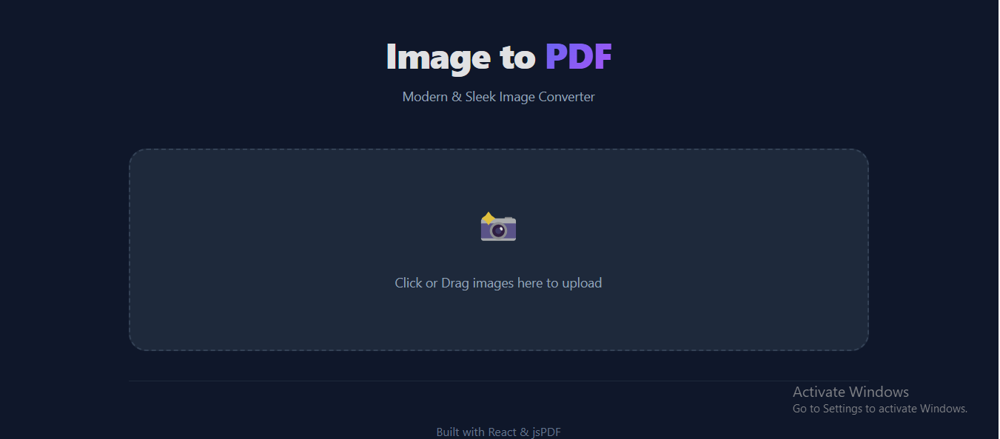

# 📄 Images to PDF Converter

A modern, sleek, and high-performance React application built with TypeScript and Vite that allows users to convert multiple images into a high-quality PDF document instantly in their browser.



## ✨ Features

- **Modern & Sleek UI**: A professional dark-themed interface with smooth transitions and glassmorphism elements.
- **Drag & Drop**: Easily upload images by dragging them into the drop zone or clicking to browse.
- **Image Preview**: View all uploaded images in a beautiful grid before conversion.
- **Dynamic Management**: Remove unwanted images before generating the PDF.
- **Drag & Drop Reordering**: Rearrange your images in any order before generating the PDF with a smooth drag-and-drop interface.
- **Smart Scaling**: Images are automatically scaled to fit standard PDF page dimensions while maintaining their original aspect ratio.
- **Privacy First**: All processing happens locally in the user's browser. Images are never uploaded to a server.
- **Fast & Lightweight**: Built with Vite and React for near-instant load times and high performance.

## 🛠️ Tech Stack

- **Frontend**: [React 19](https://react.dev/)
- **Language**: [TypeScript](https://www.typescriptlang.org/)
- **Bundler**: [Vite](https://vitejs.dev/)
- **PDF Generation**: [jsPDF](https://github.com/parallax/jsPDF)
- **Styling**: Vanilla CSS (Modern CSS Variables, Flexbox, and Grid)

## 🚀 Getting Started

### Prerequisites

Make sure you have [Node.js](https://nodejs.org/) installed on your machine.

### Installation

1. **Clone the repository** (if applicable):
   ```bash
   git clone <repository-url>
   cd images-to-pdf
   ```

2. **Install dependencies**:
   ```bash
   npm install
   ```

3. **Start the development server**:
   ```bash
   npm run dev
   ```

4. **Open in browser**:
   Navigate to `http://localhost:5173` (or the URL provided by Vite).

## 🏗️ Building for Production

To create an optimized production build:

```bash
npm run build
```

The output will be in the `dist/` directory, ready to be deployed to any static hosting service like Vercel, Netlify, or GitHub Pages.

## 📁 Project Structure

```text
images-to-pdf/
├── src/
│   ├── assets/       # Static assets like icons
│   ├── App.tsx       # Main application component & logic
│   ├── App.css       # Main application styling
│   ├── index.css     # Global styles & resets
│   └── main.tsx      # Entry point
├── public/           # Static public assets
├── index.html        # HTML template
├── package.json      # Dependencies and scripts
└── tsconfig.json     # TypeScript configuration
```

## 📝 Usage Guide

1. **Upload**: Click the "Drop Zone" or drag several images (JPG, PNG, WebP) onto it.
2. **Review**: Check the image grid. If you accidentally added a wrong image, click the **×** button on the image card to remove it.
3. **Convert**: Click the "Convert to PDF" button. A loading indicator will appear while the PDF is being generated.
4. **Download**: The browser will automatically prompt you to save the generated `converted.pdf` file.

## 🤝 Contributing

Contributions are welcome! Feel free to open an issue or submit a pull request for any improvements or features.

## 📄 License

This project is open-source and available under the [MIT License](LICENSE).

---

Built with ❤️ by Gemini CLI
